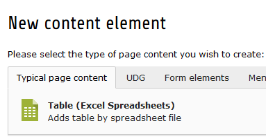
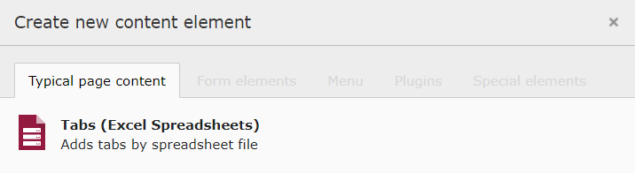
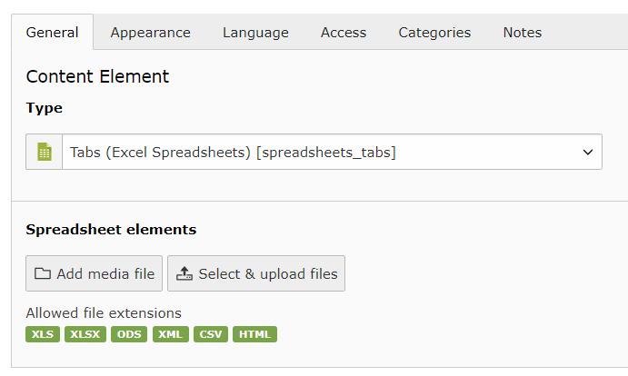

.. include:: ../Includes.txt

.. _for-editors:

===========
For Editors
===========

Target group: **Editors**

This extension will support editors & authors by providing

- Upload for several spreadsheet data based files such as

  - Excel 95 and above (.xls)
  - Excel 2007 and above (.xlsx)
  - Open Document Format/OASIS (.ods)
  - SpreadsheetML / Excel 2003 (.xml)
  - Comma-separated values (.csv)
  - Hypertext Markup Language Tables (.html)

- Spreadsheet file and Worksheet selection input

  - with optional support for cell selection
  - and option to read selection by rows or columns

- Default element to display a selected worksheet in frontend

.. _editor-content-element:

Content Element
===============

Create a new element in TYPO3 backend and select under "Typcial page content" the element "Table (Excel Spreadsheets)"

**Upload Field with Worksheet Selection**

Some modules (incl. the above "Table (Excel Spreadsheets)") are using a upload field with an additional worksheet selection.
The worksheet selection is pretty simple. Just select one of the uploaded spreadsheet files and then select the worksheet.
The output and use case of the worksheet data can differ from module to module. Please see documentation of these modules to understand more about their usages.

.. figure:: ../Images/spreadsheet-select-sheets.png
   :class: with-shadow
   :alt: Spreadsheet Sheet Selection
   :width: 300px

**Upload Field with Cell Selection**

Some modules will use an extended spreadsheet selection which will allow to select specific cells from a worksheet.
The cell selection is pretty the same as the worksheet selection except that a simplified table representation of the selected worksheet will be shown.
In this representation it is possible to select single cells, rows (incl. multiple), columns (incl. multiple) and ranges.

.. figure:: ../Images/spreadsheet-select-cells.png
   :class: with-shadow
   :alt: Spreadsheet Cell Selection
   :width: 300px

.. _editor-content-element-tabs:

Tabs Content Element
====================

Create a new element in TYPO3 backend and select under "Typcial page content" the element "Tabs (Excel Spreadsheets)"

**Upload field**

Simply upload and select a spreadsheet file and it's worksheets will be displayed as multiple tabs

.. attention::
   :class: cc

   Please note that this content element is not shown by default. You or an administrator
   can enable it in the extension settings of TYPO3. Or it is enabled/disabled by development :ref:`configuration <configuration-features>`

   .. figure:: ../Images/spreadsheet-tabs-enable.png
      :class: with-shadow
      :alt: Enabling tabs content element
      :width: 200px

.. _editor-faq:

FAQ
===

Possible subsection: FAQ
