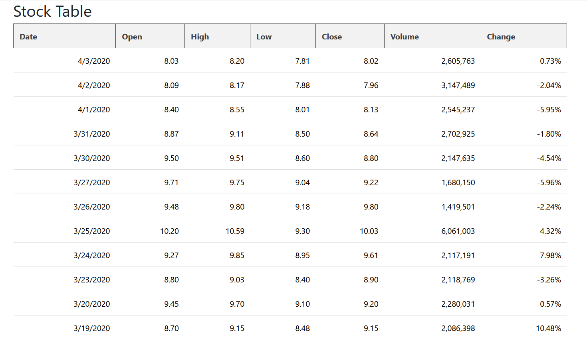
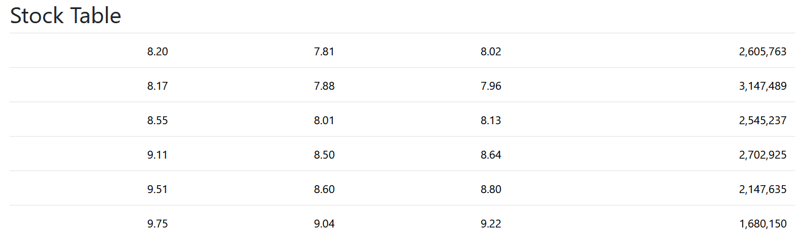
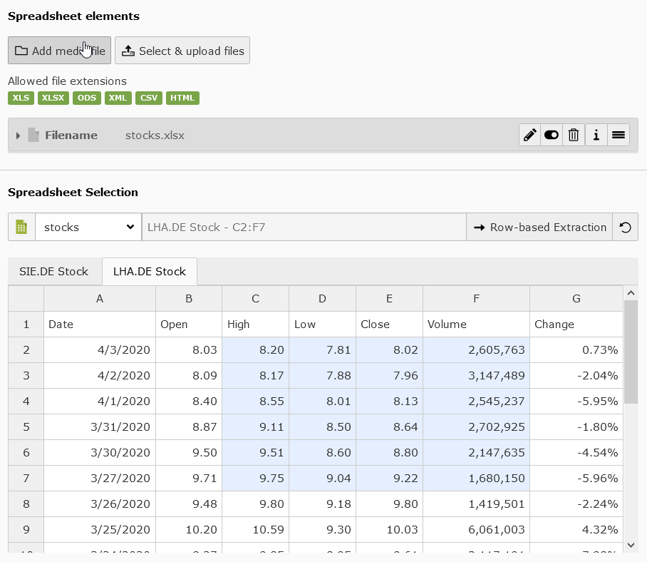

.. include:: ../Includes.txt

.. _introduction:

============
Introduction
============

.. _what-it-does:

What does it do?
================

With this extension you are able:

- to provide an automatic way of displaying spreadsheet based files e.g. Excel spreadsheets
- to define TCA input fields that can extract selectable data from your worksheets

  - supports worksheet selection
  - supports cell selection (single, columns, rows and range) incl. merge cells
  - supports direction how to interpret the selection (row-/column-based)

...but a picture is worth a thousand words so heads up to the screenshots below 😁

.. hint::

   For extended usage of this extension take a look into `Charts extension <http://typo3.org/extensions/repository/view/charts/current/>`_

.. _screenshots:

Screenshots
===========

.. image:: ../Images/example-1.png
   :class: float-right
   :alt: Simple/default worksheet selection in backend
   :width: 360px

.. important::
   :class: cc

   The default editor configuration (of element "Table (Excel Spreadsheets)") allows the user to select a worksheet to display in frontend.

.. hint::
   :class: cc

   Please note the header row of the default element "Table (Excel Spreadsheets)" above which outputs the existing styling of the spreadsheet cells!

   Per default the element will use and output cell styling (except conditional styles) which might be set in programs like Excel.

   If you want to output only table data and use your own table styling heads up to the "Appearance" tab and tick the checkbox on "Spreadsheet Styling" to disable default styling.

.. important::
   :class: cc

   With full enabled configuration the user is allowed to select a specific range from any available worksheet.
