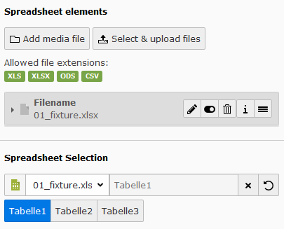
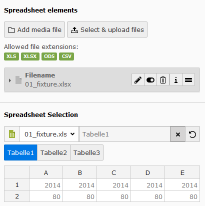

# TYPO3 Extension ``spreadsheets``

> Extension to add field definition and plugin to show and select informations from spreadsheets

## Features
- Based on extbase & fluid, implementing best practices from TYPO3 CMS
- Supporting editors & authors by providing
	- Worksheet selection by name (after selecting file)
	- (optional) cell selection after Worksheet has been selected
	- fluid based content element to display worksheet as HTML table in frontend
- Supporting developers by providing
	- TCA renderType to easily add spreadsheet selection
	- option to disable cell selection and only select worksheets
	- DataProcessor to get spreadsheet cell data from database value (e.g. `file:123|1!A1:B5` points to file reference 123 the first worksheet and the cells A1 to B5)

## Users Manual
### Table (Excel Spreadsheets)
Create a new element in TYPO3 backend and select under "Typcial page content" the element "Table (Excel Spreadsheets)"

")

### Upload Field with Worksheet Selection
Some modules (incl. the above "Table (Excel Spreadsheets)") are using a upload field with an additional worksheet selection.
The worksheet selection is pretty simple. Just select one of the uploaded spreadsheet files and then select the worksheet.
The output and use case of the worksheet data can differ from module to module. Please see documentation of these modules to understand more about their usages.



### Upload Field with Cell Selection
Some modules will use an extended spreadsheet selection which will allow to select specific cells from a worksheet.
The cell selection is pretty the same as the worksheet selection except that a simplified table representation of the selected worksheet will be shown.
In this representation it is possible to select single cells, rows (incl. multiple), columns (incl. multiple) and ranges.



## Developer Informations
### TCA (Table Configuration Array)
Using the features of this extension is pretty simple. Just use the following configuration in a TCA field of type "text" or "input":
```php
'config' => [
    'renderType'            => 'spreadsheetInput',
    'uploadField'           => 'tx_spreadsheets_assets',
    'sheetsOnly'            => false,
    'allowColumnExtraction' => true,
],
``` 

#### Field "renderType"
Set this value always to **spreadsheetInput**. See official documentation for more informations about "renderType"'s in [TYPO3's TCA Documentation](https://docs.typo3.org/typo3cms/TCAReference/latest/Columns/Index.html).

#### Field "uploadField"
The value should point to a upload field in the same dataset (e.g. tt_content's "assets", "image" or "media" fields).
This field should be responsible for uploading files of the following file extensions (all extensions are optional):
- Excel 95 and above (.xls)
- Excel 2007 and above (.xlsx)
- Open Document Format/OASIS (.ods)
- SpreadsheetML / Excel 2003 (.xml)
- Comma-separated values (.csv)
- Hypertext Markup Language Tables (.html)

#### Field "sheetsOnly"
This field can be set to `true` or `false`. Default value is `false`!

On default (value `false`) the user is able to select one file which was previously uploaded in "uploadField" (see above).
After selecting the file the user gets a list of worksheets to select. After selecting the right worksheet the user sees simplified table data and can select the cells he wants ;)

If field value is `true` the user can only select a worksheet and the exact cell selecting is disabled.  

#### Field "allowColumnExtraction"
This field can be set to `true` or `false`. Default value is `false`!

If field value is `true` the user can choose whether his selection should be extract by columns or by rows.  
